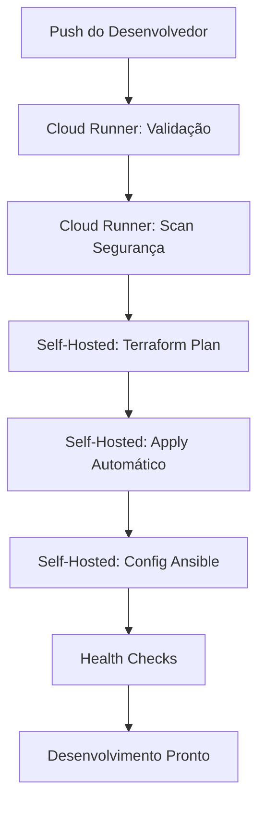
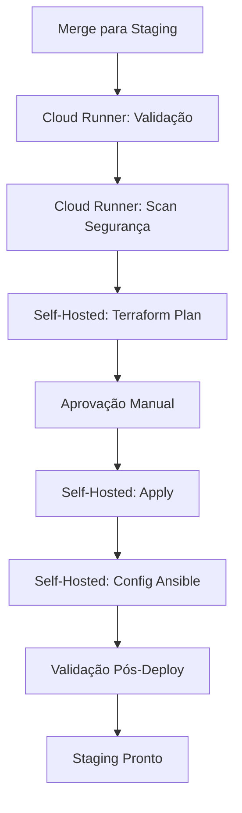
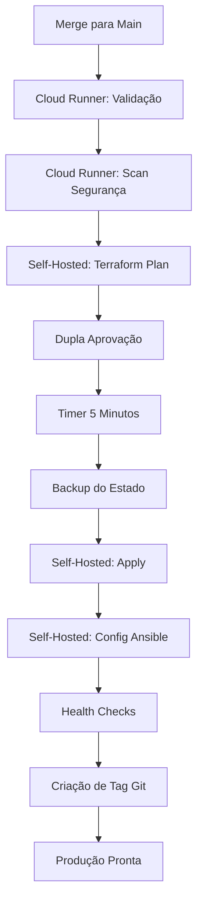

# Visão Geral da Arquitetura - CI/CD Proxmox Genérico

## Arquitetura do Sistema

Este template fornece um pipeline CI/CD pronto para produção para gerenciamento de infraestrutura Proxmox usando princípios de Infraestrutura como Código (IaC).

## Design de Rede

### Layout de Rede Recomendado

```
┌─────────────────────────────────────────────────────────────┐
│                    TOPOLOGIA DE REDE                       │
├─────────────────────────────────────────────────────────────┤
│                                                             │
│  REDE COM ACESSO À INTERNET                               │
│  ├─ Rede: 10.21.250.0/24                                  │
│  ├─ Gateway: 10.21.250.1                                  │
│  ├─ Propósito: Desenvolvimento, runners CI/CD              │
│  └─ Internet: Disponível                                   │
│                                                             │
│  REDE INTERNA/PRODUÇÃO                                    │
│  ├─ Rede: 10.11.95.0/24                                   │
│  ├─ Gateway: 10.11.95.1                                   │
│  ├─ Propósito: Serviços de produção, gerenciamento Proxmox │
│  └─ Internet: Isolada (recomendado)                        │
│                                                             │
└─────────────────────────────────────────────────────────────┘
```

### Estratégia de Alocação de VMID

| Ambiente | Range VMID | Descrição | Rede |
|-------------|------------|-------------|---------|
| **Desenvolvimento** | `1000-1999` | VMs dev/teste | Acesso à internet |
| **Staging** | `2000-2999` | Pré-produção | Acesso à internet |
| **Produção** | `3000-3999` | Serviços produtivos | Apenas interno |
| **Infraestrutura** | `9000-9999` | Ferramentas de gerenciamento | Misto |

## Fluxo do Pipeline CI/CD

### Ambiente de Desenvolvimento (Deploy Automático)



### Ambiente de Staging (1 Aprovação)



### Ambiente de Produção (2 Aprovações + Timer)



## Camadas de Segurança

### Camada 1: Qualidade de Código (Cloud Runners)
- Validação de formato Terraform
- Validação de sintaxe Terraform
- Verificação de sintaxe Ansible
- Linting YAML

### Camada 2: Scanning de Segurança (Cloud Runners)
- **tfsec**: Scanner de segurança Terraform
- **checkov**: Segurança e conformidade IaC
- **trivy**: Scanner de vulnerabilidades
- **ansible-lint**: Melhores práticas Ansible

### Camada 3: Segurança de Rede (Self-Hosted)
- Runner em rede isolada/controlada
- Acesso à API através de firewalls
- Autenticação baseada apenas em chaves SSH
- TLS/SSL para todas as comunicações API

### Camada 4: Controle de Acesso
- Permissões do repositório GitHub
- Aprovações específicas por ambiente
- Janelas de deployment baseadas em tempo
- Log de auditoria para todas as ações

## Componentes de Infraestrutura

### Requisitos do Cluster Proxmox

```yaml
Configuração Mínima do Cluster:
  nós: 2+ (3+ recomendado)
  nó_primário:
    papel: Endpoint API, líder do cluster
    requisitos:
      - Proxmox VE 7.0+
      - Acesso à API habilitado
      - Autenticação baseada em token configurada
  nós_secundários:
    papel: Membros do cluster
    requisitos:
      - Unidos ao cluster
      - Storage compartilhado (opcional)
```

### Especificações do Self-Hosted Runner

```yaml
Requisitos da VM Runner:
  cpu: 2+ cores
  memória: 4+ GB RAM
  storage: 50+ GB disco
  rede: Acesso à internet obrigatório
  so: Ubuntu 22.04 LTS (recomendado)
  software:
    - Docker
    - Terraform 1.5+
    - Ansible 2.15+
    - Python 3.8+
    - Git
```

## Artefatos de Deployment

### Artefatos Gerados

| Artefato | Ambiente | Retenção | Propósito |
|----------|-------------|-----------|---------|
| `tfplan-dev` | Desenvolvimento | 5 dias | Revisão de mudanças |
| `tfplan-staging` | Staging | 15 dias | Base para aprovação |
| `tfplan-production` | Produção | 90 dias | Trilha de auditoria |
| `infrastructure-outputs` | Todos | 30 dias | Informações de recursos |
| `ansible-logs` | Todos | 90 dias | Logs de configuração |

### Gerenciamento de Estado

```yaml
Estado Terraform:
  backend: local (padrão)
  arquivos:
    - terraform-dev.tfstate
    - terraform-staging.tfstate
    - terraform-production.tfstate
  backup: automático antes das mudanças

Melhoria Futura:
  backend: s3 (ou minio)
  locking: dynamodb (ou equivalente)
```

## Triggers de Workflow

### Triggers Automáticos

| Evento | Ambiente | Ação |
|-------|-------------|--------|
| Push para `develop` | Desenvolvimento | Deploy automático |
| Push para `staging` | Staging | Plan + aguardar aprovação |
| Push para `main` | Produção | Plan + aguardar dupla aprovação |

### Triggers Manuais

```yaml
workflow_dispatch:
  inputs:
    environment:
      - development
      - staging
      - production
    action:
      - plan
      - apply
      - destroy
```

## Monitoramento e Observabilidade

### Monitoramento Integrado

- Status dos workflows GitHub Actions
- Saúde do self-hosted runner
- Taxas de sucesso do Terraform plan/apply
- Status de execução dos playbooks Ansible

### Pontos de Integração

```yaml
Integrações Opcionais:
  notificações:
    - Slack
    - Discord
    - Email
  monitoramento:
    - Prometheus
    - Grafana
    - Zabbix
  logging:
    - ELK Stack
    - Fluentd
```

## Considerações de Escalabilidade

### Escalonamento Horizontal

- Múltiplos self-hosted runners
- Grupos de runners por ambiente
- Balanceamento de carga entre nós Proxmox

### Escalonamento Vertical

- Alocação de recursos do runner
- Configurações de paralelismo Terraform
- Otimização de fork count Ansible

## Melhores Práticas

### Workflow de Desenvolvimento

1. Branches de funcionalidade a partir de `develop`
2. Testes locais antes do push
3. Mudanças pequenas e incrementais
4. Mensagens de commit descritivas

### Práticas de Segurança

1. Rotação regular de tokens
2. Princípio do menor privilégio
3. Segmentação de rede
4. Scans de segurança regulares

### Práticas Operacionais

1. Backups regulares
2. Monitoramento e alertas
3. Atualizações de documentação
4. Testes de recuperação de desastres

---

**Versão da Arquitetura:** 1.0.0
**Última Atualização:** 2025-10-24
**Compatibilidade:** Proxmox VE 7.0+, GitHub Actions