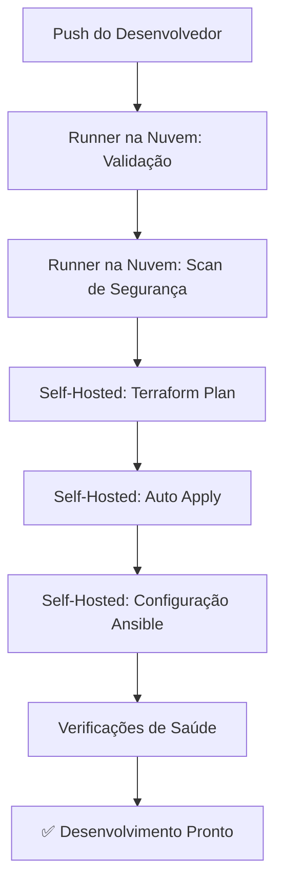
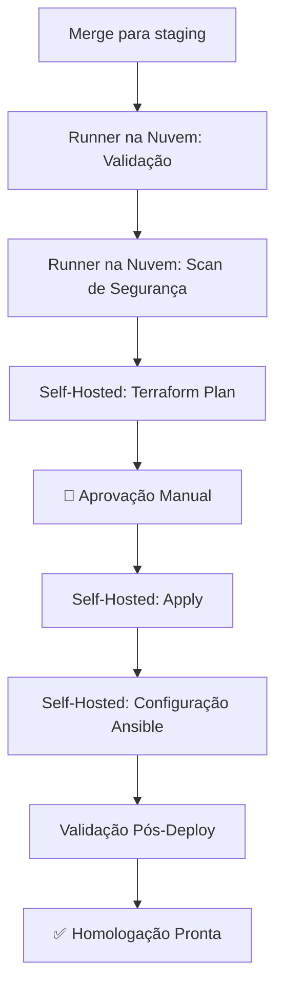
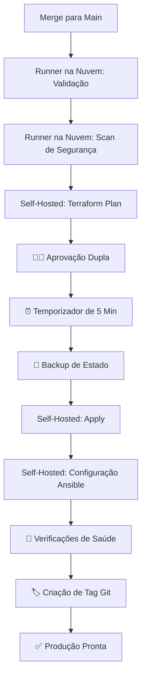

# Visão Geral da Arquitetura - CI/CD Genérico para Proxmox

## Arquitetura do Sistema

Este template fornece um pipeline de CI/CD pronto para produção para o gerenciamento de infraestrutura Proxmox usando os princípios de Infraestrutura como Código (IaC).

## Design da Rede

### Layout de Rede Recomendado

```
┌─────────────────────────────────────────────────────────────┐
│                    TOPOLOGIA DE REDE                         │
├─────────────────────────────────────────────────────────────┤
│                                                             │
│   REDE COM ACESSO À INTERNET                             │
│  ├─ Rede: 10.21.250.0/24                                  │
│  ├─ Gateway: 10.21.250.1                                  │
│  ├─ Propósito: Desenvolvimento, runners de CI/CD           │
│  └─ Internet: ✅ Disponível                                │
│                                                             │
│   REDE INTERNA/PRODUÇÃO                                  │
│  ├─ Rede: 10.11.95.0/24                                   │
│  ├─ Gateway: 10.11.95.1                                   │
│  ├─ Propósito: Serviços de produção, gerenciamento Proxmox │
│  └─ Internet: ❌ Isolada (recomendado)                     │
│                                                             │
└─────────────────────────────────────────────────────────────┘
```

### Estratégia de Alocação de VMID

| Ambiente       | Faixa de VMID | Descrição          | Rede                |
|----------------|---------------|--------------------|---------------------|
| **Desenvolvimento** | `1000-1999`   | VMs de dev/teste   | Acessível pela Internet |
| **Homologação**  | `2000-2999`   | Pré-produção       | Acessível pela Internet |
| **Produção**     | `3000-3999`   | Serviços ativos    | Apenas interna      |
| **Infraestrutura** | `9000-9999`   | Ferramentas de ger. | Mista               |

## Fluxo do Pipeline de CI/CD

### Ambiente de Desenvolvimento (Auto-Deploy)



### Ambiente de Homologação (1 Aprovação)



### Ambiente de Produção (2 Aprovações + Temporizador)



## Camadas de Segurança

### Camada 1: Qualidade do Código (Runners na Nuvem)
- Validação de formato do Terraform
- Validação de sintaxe do Terraform
- Verificação de sintaxe do Ansible
- Linting de YAML

### Camada 2: Análise de Segurança (Runners na Nuvem)
- **tfsec**: Scanner de segurança para Terraform
- **checkov**: Segurança e conformidade de IaC
- **trivy**: Scanner de vulnerabilidades
- **ansible-lint**: Melhores práticas para Ansible

### Camada 3: Segurança de Rede (Self-Hosted)
- Runner em rede isolada/controlada
- Acesso à API através de firewalls
- Autenticação apenas com chave SSH
- TLS/SSL para todas as comunicações de API

### Camada 4: Controle de Acesso
- Permissões de repositório do GitHub
- Aprovações específicas por ambiente
- Janelas de implantação baseadas em tempo
- Log de auditoria para todas as ações

## Componentes de Infraestrutura

### Proxmox Cluster Requirements

```yaml
Minimum Cluster Configuration:
  nodes: 2+ (3+ recommended)
  primary_node:
    role: API endpoint, cluster leader
    requirements:
      - Proxmox VE 7.0+
      - API access enabled
      - Token-based auth configured
  secondary_nodes:
    role: Cluster members
    requirements:
      - Joined to cluster
      - Shared storage (optional)
```

### Self-Hosted Runner Specifications

```yaml
Runner VM Requirements:
  cpu: 2+ cores
  memory: 4+ GB RAM
  storage: 50+ GB disk
  network: Internet access required
  os: Ubuntu 22.04 LTS (recommended)
  software:
    - Docker
    - Terraform 1.5+
    - Ansible 2.15+
    - Python 3.8+
    - Git
```

## Artefatos de Implantação

### Artefatos Gerados

| Artefato | Ambiente | Retenção | Propósito |
|----------|-------------|-----------|---------|
| `tfplan-dev` | Desenvolvimento | 5 dias | Revisão de mudanças |
| `tfplan-staging` | Homologação | 15 dias | Base para aprovação |
| `tfplan-production` | Produção | 90 dias | Trilha de auditoria |
| `infrastructure-outputs` | Todos | 30 dias | Informações de recursos |
| `ansible-logs` | Todos | 90 dias | Logs de configuração |

### State Management

```yaml
Terraform State:
  backend: local (default)
  files:
    - terraform-dev.tfstate
    - terraform-staging.tfstate
    - terraform-production.tfstate
  backup: automatic before changes

Future Enhancement:
  backend: s3 (or minio)
  locking: dynamodb (or equivalent)
```

## Gatilhos de Workflow

### Gatilhos Automáticos

| Evento | Ambiente | Ação |
|-------|-------------|--------|
| Push para `develop` | Desenvolvimento | Auto-deploy |
| Push para `staging` | Staging (Homologação) | Plan + aguarda aprovação |
| Push para `main` | Produção | Plan + aguarda aprovação dupla |

### Gatilhos Manuais

```yaml
workflow_dispatch:
  inputs:
    environment:
      - development
      - staging
      - production
    action:
      - plan
      - apply
      - destroy
```

## Monitoramento e Observabilidade

### Monitoramento Integrado

- Status do workflow do GitHub Actions
- Saúde do runner self-hosted
- Taxas de sucesso de plan/apply do Terraform
- Status de execução do playbook Ansible

### Integration Points

```yaml
Optional Integrations:
  notifications:
    - Slack
    - Discord
    - Email
  monitoring:
    - Prometheus
    - Grafana
    - Zabbix
  logging:
    - ELK Stack
    - Fluentd
```

## Considerações de Escalabilidade

### Escalabilidade Horizontal

- Múltiplos runners self-hosted
- Grupos de runners por ambiente
- Balanceamento de carga entre os nós do Proxmox

### Escalabilidade Vertical

- Alocação de recursos do runner
- Configurações de paralelismo do Terraform
- Otimização da contagem de forks do Ansible

## Melhores Práticas

### Fluxo de Trabalho de Desenvolvimento

1. Branches de feature a partir de `develop`
2. Testes locais antes do push
3. Mudanças pequenas e incrementais
4. Mensagens de commit descritivas

### Práticas de Segurança

1. Rotação regular de tokens
2. Princípio do privilégio mínimo
3. Segmentação de rede
4. Scans de segurança regulares

### Práticas Operacionais

1. Backups regulares
2. Monitoramento e alertas
3. Atualizações da documentação
4. Testes de recuperação de desastres

---

**Versão da Arquitetura:** 1.0.0
**Última Atualização:** 2025-10-24
**Compatibilidade:** Proxmox VE 7.0+, GitHub Actions